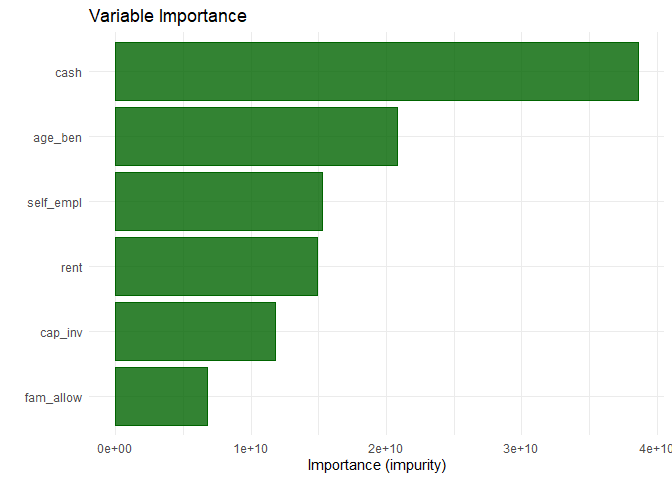
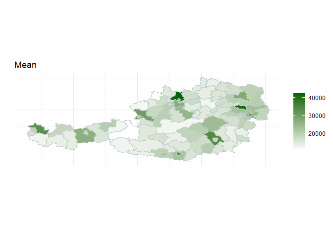

<!-- README.md is generated from README.Rmd. Please edit that file -->

# SAEforest

<!-- badges: start -->
<!-- badges: end -->

The package promotes the use of Mixed Effects Random Forests (MERFs) for
applications of Small Area Estimation (SAE). The package effectively
combines functions for the estimation of regionally disaggregated linear
and nonlinear economic and inequality indicators using survey sample
data. Estimated models increase the precision of direct estimates from
survey data, combining unit-level and aggregated population level
covariate information from census or register data. Apart from point
estimates, MSE estimates for requested indicators can be easily
obtained. The package provides procedures to facilitate the analysis of
model performance of MERFs and visualizes predictive relations from
covariates and variable importance. Additionally, users can summarize
and map indicators and corresponding measures of uncertainty.

## Installation

You can install the development version of SAEforest from Github with:

``` r
# install.packages("devtools")
devtools::install_github("krennpa/SAEforest")
```

## Example

This is a basic example which demonstrates the functionality of this
package:

``` r
library(SAEforest)

data("eusilcA_pop")
data("eusilcA_smp")

income <- eusilcA_smp$eqIncome
X_covar <- eusilcA_smp[,-c(1,16,17,18)]

#Example 1:
#Calculating point estimates and discussing basic generic functions

model1 <- SAEforest_model(Y = income, X = X_covar, dName = "district",
                         smp_data = eusilcA_smp, pop_data = eusilcA_pop)

#SAEforest generics:
summary(model1)
#> ________________________________________________________________
#> Mixed Effects Random Forest for Small Area Estimation
#> ________________________________________________________________
#> Call:
#> SAEforest_model(Y = income, X = X_covar, dName = "district", 
#>     smp_data = eusilcA_smp, pop_data = eusilcA_pop)
#> 
#> Domains
#> ________________________________________________________________
#>  In-sample Out-of-sample Total
#>         70            24    94
#> 
#> Totals:
#> Units in sample: 1945 
#> Units in population: 25000 
#> 
#>                    Min. 1st Qu. Median      Mean 3rd Qu. Max.
#> Sample_domains       14    17.0   22.5  27.78571   29.00  200
#> Population_domains    5   126.5  181.5 265.95745  265.75 5857
#> 
#> Random forest component: 
#> ________________________________________________________________
#>                                            
#> Type:                            Regression
#> Number of trees:                        500
#> Number of independent variables:         14
#> Mtry:                                     3
#> Minimal node size:                        5
#> Variable importance mode:          impurity
#> Splitrule:                         variance
#> Rsquared (OOB):                     0.62976
#> 
#> Structural component of random effects:
#> ________________________________________________________________
#> Linear mixed model fit by maximum likelihood  ['lmerMod']
#> Formula: Target ~ -1 + (1 | district)
#>    Data: data
#>  Offset: forest_preds
#> 
#>      AIC      BIC   logLik deviance df.resid 
#>  39193.1  39204.2 -19594.5  39189.1     1943 
#> 
#> Scaled residuals: 
#>     Min      1Q  Median      3Q     Max 
#> -2.9730 -0.5194 -0.0759  0.4448 11.8159 
#> 
#> Random effects:
#>  Groups   Name        Variance Std.Dev.
#>  district (Intercept) 11157235 3340    
#>  Residual             30335770 5508    
#> Number of obs: 1945, groups:  district, 70
#> 
#> ICC:  0.2688944 
#> 
#> Convergence of MERF algorithm: 
#> ________________________________________________________________
#> Convergence achieved after 4 iterations.
#> A maximum of 25 iterations used and tolerance set to: 1e-04 
#> 
#> Monitored Log-Likelihood:                                          
#>  0 -19545.67 -19573.45 -19593.59 -19594.53
```

I included some further features to inspect the model graphically. For
instance look at the following output from the generic function `plot`,
which shows a so-called variable importance plot:


    #> Press [enter] to continue

We cannot only inspect the model graphically, but also map our
indicators. Take a look at this example on Austrian pseudo-data for
district-level mean income produced by the function `map_indicators`:


I hope you like this presentation and the package. If you are interested
in model-based SAE you should definitely also check out package `emdi`.
